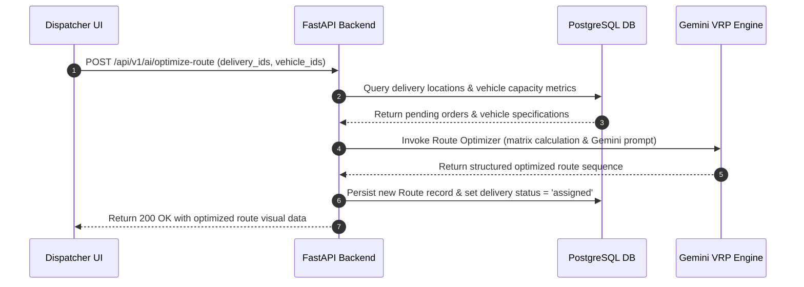
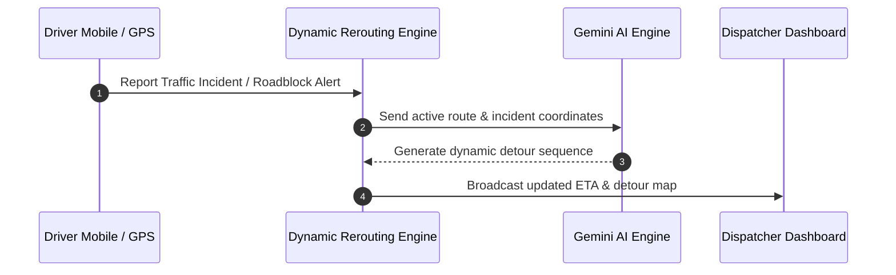

# 📊 System Sequence & Workflow Diagrams

## 1. Route Optimization Sequence Diagram

```mermaid
sequenceDiagram
    autonumber
    participant D as Dispatcher UI
    participant API as FastAPI Backend
    participant DB as PostgreSQL DB
    participant AI as Gemini VRP Engine

    D->>API: POST /api/v1/ai/optimize-route (delivery_ids, vehicle_ids)
    API->>DB: Query delivery locations & vehicle capacity metrics
    DB-->>API: Return pending orders & vehicle specifications
    API->>AI: Invoke Route Optimizer (matrix calculation & Gemini prompt)
    AI-->>API: Return structured optimized route sequence
    API->>DB: Persist new Route record & set delivery status = 'assigned'
    API-->>D: Return 200 OK with optimized route visual data
```

## 2. Dynamic Rerouting Sequence Diagram

```mermaid
sequenceDiagram
    autonumber
    participant Driver as Driver Mobile / GPS
    participant Engine as Dynamic Rerouting Engine
    participant AI as Gemini AI Engine
    participant Dispatch as Dispatcher Dashboard

    Driver->>Engine: Report Traffic Incident / Roadblock Alert
    Engine->>AI: Send active route & incident coordinates
    AI-->>Engine: Generate dynamic detour sequence
    Engine->>Dispatch: Broadcast updated ETA & detour map
```
